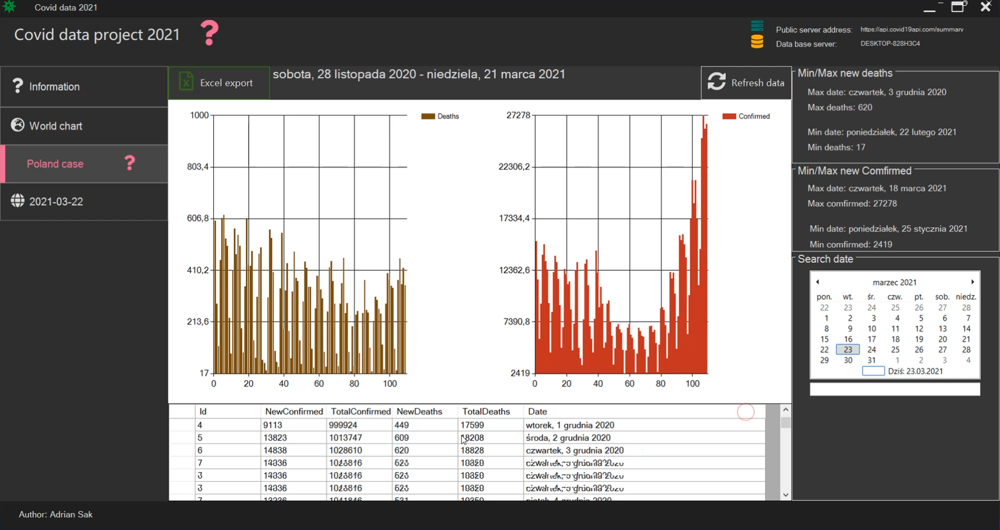

# Application for presenting COVID-19 data

Application presents in a user-friendly way, data from pandemic times. 

### How it works?
The application connects to the API provided by Postman, containing pandemic data for individual days for various countries, including new infections, deaths, and recoveries. Additionally, it connects to the MS SQL database server to retrieve data from Poland, which I've attempted to regularly fetch from the Postman API and save in my database. For presenting data application used, bar charts, map chart where data from individual countries is injected.

#### The main functionalities of the application
* Providing the latest pandemic data and presenting it in JSON format
* The ability to export data to Excel: from the database and daily data from the current day.
* Graphical presentation data on charts.
* The ability to browse the latest pandemic information through a connection to the WHO website.

#### Technologies that i used:
* C#
* Windows Forms
* Entity Framework
* MS SQL
* LiveCharts

#### How it's looks like:
Below are several screenshots presenting the main functionalities of the application.

